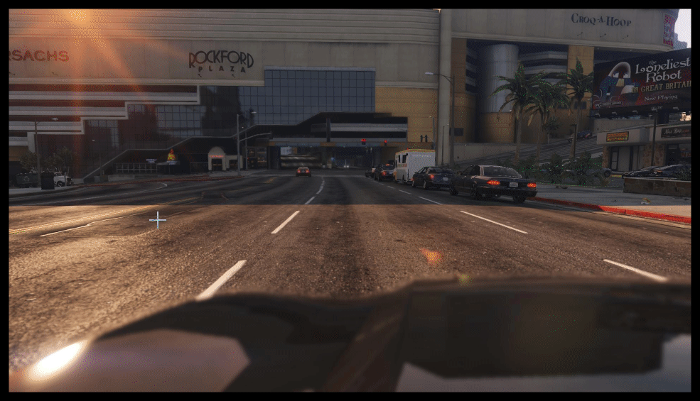

# DeepBillboard-based attack recognition and mitigation

This project provides the tools needed to create a dataset of attack billboards, and to train a model to recognize and neutralize attack billboards.

_Example of arbitrary billboard content creation_  


## Setup

It is recommended to use a [virtualenv](https://docs.python.org/3/library/venv.html).

This project has been developed using Python 3.8.6.

Additional required libraries can be installed from the provided [requirements.txt](app/requirements.txt) file.

[app/](app/) is the expected working directory.

```powershell
pip install -r requirements.txt
```

## Usage

Notebook files can be found under [app/src/demos](app/src/demos).
Notebook files expect the working directory to be the `demos/` directory.
